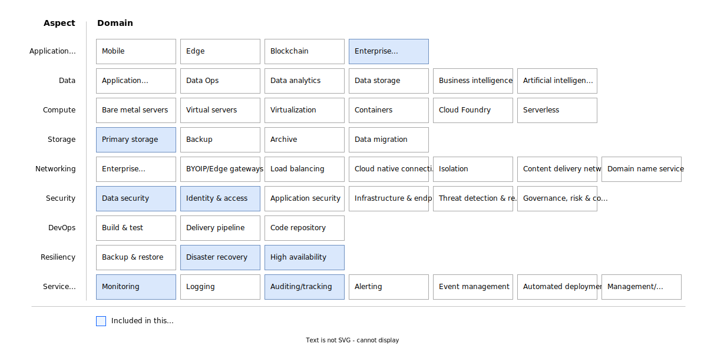

---

# The YAML header is required. For more information about the YAML header, see
# https://test.cloud.ibm.com/docs/writing?topic=writing-reference-architectures

copyright:
  years: 2024
lastupdated: "2024-11-18"

keywords: # Not typically populated

subcollection: deployable-reference-architectures

authors:
  - name: "Chris Waddington"
    url: "https://github.com/chrisw-ibm"

# The release that the reference architecture describes
version: 1.0.x

# Use if the reference architecture has deployable code.
# Value is the URL to land the user in the IBM Cloud catalog details page for the deployable architecture.
# See https://test.cloud.ibm.com/docs/get-coding?topic=get-coding-deploy-button
deployment-url: https://cloud.ibm.com/catalog/cda5c842-ca01-468e-9614-0be561a792dc/architecture/deploy-arch-ibm-cloudability-1b3dcf22-f451-4443-b885-01ba1847443c-global

docs: https://cloud.ibm.com/docs/track-spend-with-cloudability

image_source: https://github.com/terraform-ibm-modules/terraform-ibm-cloudability-onboarding/blob/main/reference-architectures/cloudability-all-inclusive-onboarding.svg

related_links:
  - title: 'Exporting your usage data for continual insights'
    url: 'https://cloud.ibm.com/docs/billing-usage?topic=billing-usage-exporting-your-usage'
    description: 'Exporting your usage for integration into IBM Cloudability.'

# use-case from 'code' column in
# https://github.ibm.com/digital/taxonomy/blob/main/topics/topics_flat_list.csv
use-case: FinOps

# industry from 'code' column in
# https://github.ibm.com/digital/taxonomy/blob/main/industries/industries_flat_list.csv
industry: Banking,FinancialSector,ITConsulting,Technology,Telecommunications

# compliance from 'code' column in
# https://github.ibm.com/digital/taxonomy/blob/main/compliance_entities/compliance_entities_flat_list.csv
compliance: FSCloud

content-type: reference-architecture

# For reference architectures in https://github.com/terraform-ibm-modules only.
# All reference architectures stored in the /reference-architectures directory

# Set production to true to publish the reference architecture to IBM Cloud docs.

production: true

---

{{site.data.keyword.attribute-definition-list}}

# IBM Cloudability Enablement
{: #cloudability-enablement}
{: toc-content-type="reference-architecture"}
{: toc-industry="Banking,FinancialSector,ITConsulting,Technology,Telecommunications"}
{: toc-use-case="FinOps"}
{: toc-compliance="FSCloud"}
{: toc-version="1.0.x"}

The Cloudability Enablement deployable architecture(DA) is designed to automate the deployment and configuration of adding your {{site.data.keyword.Bluemix_notm}} account or enterprise to an existing {{site.data.keyword.IBM_notm}} Cloudability account. Once enabled, {{site.data.keyword.Bluemix_notm}} billing data is made available to Cloudability allowing the tracking and analysis of {{site.data.keyword.Bluemix_notm}} expenses. Billing data is made available to Cloudability by granting access to a Cloud Object Storage (COS) bucket which contains the billing reports, which {{site.data.keyword.Bluemix_notm}} Billing updates daily.

A typical use case is to aggregate billing data from multiple cloud vendors or multiple {{site.data.keyword.Bluemix_notm}} accounts within Cloudability. This aggregation helps create a complete view of a companies cloud expenses. Also, it allows costs to be allocated based on business division, unit, or team by using Cloudability business mappings (synthetic resource tagging). This helps drive accountability of cloud costs across your organization.

## Architecture diagram
{: #architecture-diagram}

 {: caption="Cloudability Enablement deployable architecture" caption-side="bottom"}{: external download="cloudability-all-inclusive-onboarding.svg"}

The Cloudability Enablement deployable architecture creates an instance of {{site.data.keyword.cos_full_notm}} in a target {{site.data.keyword.Bluemix_notm}} account, resource group, and region. An IBM Key Protect instance is created in this same resource group and region to provide a [custom encryption key](/docs/key-protect?topic=key-protect-integrate-cos). Then, it configures [billing reports](/docs/account?topic=account-exporting-your-usage&interface=ui#enable-export-usage) to be written to the Object Storage bucket. Cloudability is granted access by the DA to read the billing reports within the bucket. Next, the {{site.data.keyword.Bluemix_notm}} account is added to Cloudability so that it is made aware of how to pull the data from Object Storage bucker. Events are sent to Monitoring and Activity Tracker by default to help track changes that are made to the Object Storage bucket.

The key management service instance (`Key Protect` or `Hyper Protect Crypto`) must be colocated in the same region as the {{site.data.keyword.cos_full_notm}} instance.
{: important}

An account can enable billing report exports for a single account.
{: important}

## Design concepts
{: #design-concepts}

{: caption="Scope of the design requirements" caption-side="bottom"}

## Requirements
{: #requirements}

The following table outlines the requirements that are addressed in this architecture.

| Aspect | Requirements |
| -------------- | -------------- |
| Enterprise applications | Setup and grant access to {{site.data.keyword.IBM_notm}} Cloudability to read billing reports for all accounts within an enterprise. |
| Storage            | Provide storage that meets the application performance and security requirements |
| Security           | * Encrypt all application data in transit and at rest to protect it from unauthorized disclosure. \n * Encrypt all security data (operational and audit logs) to protect from unauthorized disclosure. \n * Protect secrets through their entire lifecycle and secure them using access control measures. \n * Restrict access to data to only allowed members with the minimal required access. |
| Resiliency         | * Ensure availability of the services in the event of planned and unplanned outages |
| Service Management | Monitor audit logs to track changes and detect potential security problems. |
{: caption="Requirements" caption-side="bottom"}

## Components
{: #components}

The following table outlines the services that are used in the architecture for each aspect.

| Aspects | Architecture components | How the component is used |
| -------------- | -------------- | -------------- |
| Storage | Cloud Object Storage | Stores {{site.data.keyword.Bluemix_notm}} [billing reports](/docs/account?topic=account-exporting-your-usage&interface=ui#storing-usage-data) for an {{site.data.keyword.Bluemix_notm}} account or all accounts within an enterprise |
| Security | IAM | {{site.data.keyword.iamlong}} authenticates and authorizes Cloudability access to read the billing report objects and in the case of an enterprise, the list of accounts within an enterprise. |
|  | Key Protect | Key Management Service used to encrypt the object storage bucket with a custom key |
|  | Context-based restrictions | restricts access to Object Storage bucket and Key Management Service keys to only required members based on IP address |
| Resiliency | Key Protect | Support the selection of [{{site.data.keyword.keymanagementserviceshort}} failover regions](/docs/key-protect?topic=key-protect-ha-dr#availability) if needed. |
| Service Management | IBM Cloud Monitoring | Operational monitoring of your Object Storage bucket is enabled by default. |
|  | Activity Tracker Event Routing | Object Storage operational logs are enabled by default. |
{: caption="Components" caption-side="bottom"}

## Next steps
{: #next-steps}

If you don't have access to an {{site.data.keyword.IBM_notm}} Cloudability account, then you need to [create one](/docs/track-spend-with-cloudability?topic=track-spend-with-cloudability-accessing-cloudability). Once you have access to a Cloudability account, then [configure access to run the deployable architecture](/docs/track-spend-with-cloudability?topic=track-spend-with-cloudability-planning), and [deploy the cloud resources](/docs/track-spend-with-cloudability?topic=track-spend-with-cloudability-deploy-cloud).
