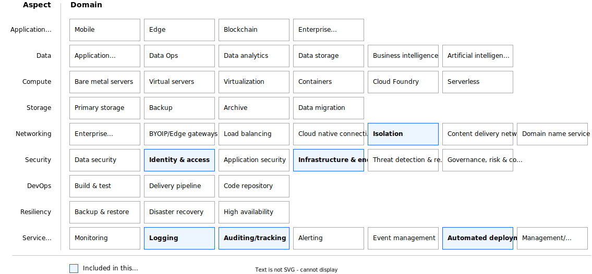

---

copyright:
  years: 2023, 2024, 2025
lastupdated: "2025-09-03"

keywords: Cloud foundation for VPC, VPC Landing Zone

subcollection: deployable-reference-architectures

authors:
  - name: "Vincent Burckhardt"

# The release that the reference architecture describes
version: 8.5.11

# Whether the reference architecture is published to Cloud Docs production.
# When set to false, the file is available only in staging. Default is false.
production: true

# Use if the reference architecture has deployable code.
# Value is the URL to land the user in the IBM Cloud catalog details page
# for the deployable architecture.
# See https://test.cloud.ibm.com/docs/get-coding?topic=get-coding-deploy-button
deployment-url: https://cloud.ibm.com/catalog/architecture/deploy-arch-ibm-slz-vpc-9fc0fa64-27af-4fed-9dce-47b3640ba739-global

docs: https://cloud.ibm.com/docs/secure-infrastructure-vpc

image_source: https://github.com/terraform-ibm-modules/terraform-ibm-landing-zone/blob/main/reference-architectures/vpc.drawio.svg

related_links:
  - title: "Cloud foundation for VPC - Standard (Financial Services edition) variation"
    url: "https://cloud.ibm.com/docs/deployable-reference-architectures?topic=deployable-reference-architectures-vpc-ra"
    description: "A deployable architecture that deploys a Virtual Private Cloud (VPC) infrastructure without any compute resources and is based on the IBM Cloud for Financial Services reference."
  - title: "Cloud foundation for VPC - Standard (Integrated setup with configurable services) variation"
    url: "https://cloud.ibm.com/docs/deployable-reference-architectures?topic=deployable-reference-architectures-vpc-fully-configurable"
    description: "A deployable architecture that deploys a simple Virtual Private Cloud (VPC) infrastructure without any compute resources."

use-case: Cybersecurity
industry: Banking,FinancialSector
compliance: FedRAMP

content-type: reference-architecture

---

{{site.data.keyword.attribute-definition-list}}

# Cloud foundation for VPC - Standard (Financial Services edition)
{: #vpc-ra}
{: toc-content-type="reference-architecture"}
{: toc-industry="Banking,FinancialSector"}
{: toc-use-case="Cybersecurity"}
{: toc-compliance="FedRAMP"}
{: toc-version="8.5.11"}

The Standard (Financial Services edition) variation of the Cloud foundation for VPC deployable architecture uses two Virtual Private Clouds (VPC), a Management VPC, and a Workload VPC to manage the environment and the deployed workloads. Each VPC is a multi-zoned, multi-subnet implementation that keeps your workloads secure. This deployable architecture aligns with [VPC reference architecture for {{site.data.keyword.cloud_notm}} for Financial Services](/docs/framework-financial-services?topic=framework-financial-services-vpc-architecture-about). It constitutes of the following capabilities:

- Defines multiple subnets in the VPC to define IP ranges and organize resources within the network.
- Includes public gateways that provide connectivity between resources in a VPC and the public internet.
- Creates ACLs and define rules for allowing or denying traffic between subnets within a VPC.
- Creates a transit gateway to connect the VPCs to each other and Virtual Private Endpoints are used to connect to IBM Cloud services.
- Creates security groups to control inbound and outbound traffic to resources within the VPC.
- Isolates and speeds traffic to the public internet by using an edge VPC in a specific location, if enabled
- Adds landing zone VPC CRNs to an existing CBR (Context-based restrictions) network zone if the existing CBR zone ID is specified.
- IBM Cloud Flow Logs for VPC enables the collection and storage of information about the internet protocol (IP) traffic that is going to and from network interfaces within your VPC. In addition, Activity Tracker logs events from enabled services.
- Adds key management by integrating the {{site.data.keyword.keymanagementservicefull_notm}} service or the {{site.data.keyword.hscrypto}}. These key management services help you create, manage, and use encryption keys to protect your sensitive data.

For more information about the components of VPCs, see [VPC concepts](/docs/framework-financial-services?topic=framework-financial-services-vpc-architecture-concepts).

For more information on how to create custom CBR (Context-based restrictions) zones and rules, see [CBR module](https://github.com/terraform-ibm-modules/terraform-ibm-cbr). Refer [Pre-wired CBR configuration for FS Cloud](https://github.com/terraform-ibm-modules/terraform-ibm-cbr/tree/main/modules/fscloud) submodule to create default Financial Services compliant coarse-grained CBR rules.

## Architecture diagram
{: #ra-vpc-architecture-diagram}

{: caption="Standard (Financial Services edition) variation of Cloud foundation for VPC" caption-side="bottom"}{: external download="vpc.drawio.svg"}

## Design requirements
{: #ra-vpc-qs-design-requirements}

{: caption="Scope of the design requirements" caption-side="bottom"}

## Components
{: #ra-vpc-components}

### VPC architecture decisions
{: #ra-vpc-components-arch}

| Requirement | Component | Reasons for choice | Alternative choice |
|-------------|-----------|--------------------|--------------------|
| * Provide infrastructure or application administration access to monitor, operate, and maintain the environment \n * Limit the number of infrastructure or application administration entry points to help ensure security audit. | Management VPC service | | |
| * Provide infrastructure for service management components like backup, monitoring, IT service management, shared storage \n * help ensure you can reach all IBM Cloud and on-premises services | Workload VPC service | | |
| * Set up network for all created services \n * Isolate network for all created services \n * help ensure all created services are interconnected | Secure landing zone components | Create a minimum set of required components for a secure landing zone | Create a modified set of required components for a secure landing zone in preset |
{: caption="Architecture decisions" caption-side="bottom"}

### Network security architecture decisions
{: #ra-vpc-components-arch-net-sec}

| Requirement | Component | Reasons for choice | Alternative choice |
|-------------|-----------|--------------------|--------------------|
| * Isolate management VPC and allow only a limited number of network connections \n * All other connections from or to management VPC are forbidden | ACL and security group rules in management VPC| | More ports might be opened in preset or added manually after deployment |
| * Isolate workload VPC and allow only a limited number of network connections \n * All other connections from or to workload VPC are forbidden | ACL and security group rules in workload VPC | | More ports might be opened in preset or added manually after deployment |
| Load VPN configuration to simplify VPN setup | VPNs | VPN configuration is the responsibility of the customer | |
{: caption="Network security architecture decisions" caption-side="bottom"}

## Next steps
{: #ra-vpc-next-steps}

- To deploy this architecture, understand [Deploying a landing zone deployable architecture](/docs/secure-infrastructure-vpc?topic=secure-infrastructure-vpc-deploy) steps.
